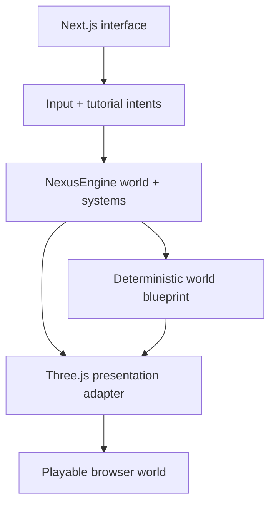

# Architecture

## Current implementation state

The audited baseline has no application architecture because it contains no product source or configuration. Everything below is the approved target architecture for the separately gated product phase, not a claim about implemented behavior.

## System boundary

NexusEngine will be the root runtime. It will own the world, ECS resources and components, events, clock, scheduler, and deterministic frame lifecycle. Three.js will translate runtime state into a WebGL scene; it will not become the canonical source of simulation state.

## Planned runtime domains

### World blueprint

A pure, seed-driven generator will produce bounded terrain samples, biome zones, landmark placements, traversal routes, atmosphere parameters, and population descriptors. The same seed and versioned rules must produce the same blueprint.

### NexusEngine integration

Planned resources include the seed, world blueprint, player state, climate/time state, tutorial progress, quality/accessibility preferences, and telemetry. Systems will advance input, movement, tutorial gates, atmosphere, and presentation synchronization through the engine lifecycle.

### Three.js presentation

The renderer adapter will build terrain buffers and instanced populations from the blueprint, own camera and WebGL resources, respond to resize and quality settings, and dispose resources predictably. Render-only animation may interpolate, but canonical state remains in NexusEngine.

### Next.js shell

The App Router page will provide the canvas host, tutorial, HUD, world inspector, accessibility controls, loading/error states, and static-export entry point. The design must remain usable from phone to wide desktop.

## Determinism and state flow

Inputs become intents, NexusEngine systems update canonical state, and the renderer consumes the resulting snapshot. Randomness must come from an explicit seeded generator rather than ambient `Math.random()` calls in runtime systems.

## Failure boundaries

- A renderer failure must surface a usable error state instead of silently presenting an empty canvas.
- A world seed must be validated and normalized before generation.
- Unsupported WebGL or reduced-resource conditions must produce a clear fallback message or quality reduction.
- External network availability must not be required for world generation after application assets load.

## Related documentation

- [Dependencies](dependencies.md)
- [Development](development.md)
- [Validation](validation.md)
- [Known issues](known-issues.md)
