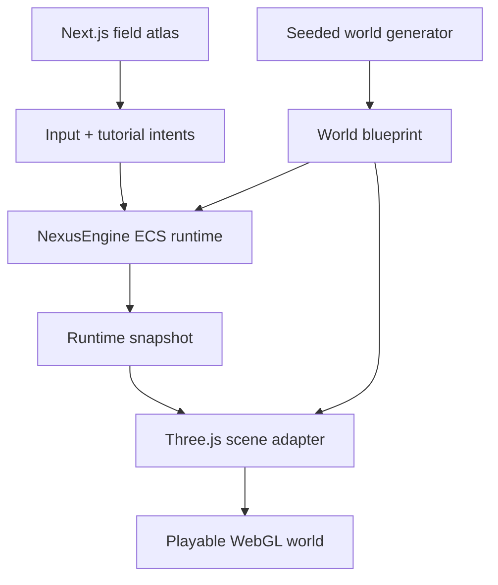

# Architecture

## Implemented system

Nexus WorldGen is a client-rendered static Next.js application. A pure seed-driven generator creates the immutable world blueprint; NexusEngine owns canonical live state and advances it through its scheduler; Three.js builds and animates the presentation scene; React provides the tutorial, controls, telemetry, fallbacks, and world inspector.

## Deterministic world blueprint

`src/world/generate-world.ts` normalizes a seed, hashes it, and uses the repository-owned PRNG/noise functions in `src/world/prng.ts`. The generator builds:

- a 196×196 terrain with 128 subdivisions per axis and 16,641 height samples;
- river, basin, shelf, ridge, peak, coast, and water-level rules;
- verdant, wetland, ember, and alpine biome classification;
- Nexus Prime, three signal beacons, and a 19-point luminous route;
- 720 trees, 260 rocks, 108 crystals, and 420 glimmers; and
- seeded atmosphere colors, wind, and temperature.

`sampleHeight()` provides bounded bilinear terrain lookup for placements and movement. No runtime world rule calls ambient `Math.random()`.

## NexusEngine runtime

`src/runtime/nexus-world-runtime.ts` imports `createEngine`, resources, components, and events from the exact pinned NexusEngine source commit. It registers the blueprint, input, tutorial, and telemetry resources plus player position, view, and motion components.

The scheduler applies:

1. `input` — normalizes requested movement and smooths velocity;
2. `simulate` — advances bounded player position and samples terrain elevation;
3. `resolve` — updates biome, Nexus range, and scan-pulse telemetry; and
4. NexusEngine's built-in `cleanup` phase.

The React client sends intents and reads snapshots. Scene objects never become canonical player or tutorial state.

## Three.js presentation

`src/render/build-world-scene.ts` converts the blueprint into terrain with vertex colors, water, instanced forest/rock/crystal populations, particles, clouds, beacons, the route, Nexus Prime, a Surveyor marker, and scan feedback. It owns camera interpolation, render-only motion, resize response, and explicit GPU-resource disposal.

The browser uses `WebGLRenderer`, ACES tone mapping, sRGB output, bounded pixel ratio, soft shadows, fog, and a custom atmosphere shader. If WebGL creation fails, the page preserves a usable model/Blueprint fallback rather than presenting an empty canvas.

## Next.js experience shell

`src/components/WorldExperience.tsx` is the sole client boundary. It provides:

- the five-stage field tutorial and replay path;
- keyboard, pointer-drag, and touch traversal;
- resonance scanning and nearest-signal reporting;
- telemetry, mission progress, compass, and world identity;
- seed entry and deterministic frontier sequence;
- responsive desktop/mobile composition;
- reduced-motion, forced-color, focus, live-region, and skip-link support; and
- opt-in synthesized ambience through Web Audio.

The App Router exports only `/` plus its generated not-found route. No remote asset, model, dataset, or generation service is required after the application loads.

## Deployment boundary

`next.config.mjs` uses `output: "export"`, unoptimized images, trailing slashes, and the optional `NEXT_PUBLIC_BASE_PATH`. `.github/workflows/deploy.yml` validates the source, builds with `/NexusWorldGen`, uploads `out/`, and deploys it through the `github-pages` environment.

## Failure and trust boundaries

- Seed input is normalized, bounded to 32 characters, and falls back to `AURELIA-7`.
- Movement and height sampling remain inside the generated terrain bounds.
- Renderer setup preflights WebGL capability, exposes an accessible world-model fallback, and disposes scene resources on reforge/unmount.
- Audio starts only after an explicit user action and closes cleanly.
- The supplied social screenshot is inspiration, not source or evidence of image reconstruction.
- Pages availability is verified; WebGL-capable browsers and real-device behavior require their own environment evidence.

## Related documentation

- [Dependencies](dependencies.md)
- [Development](development.md)
- [Validation](validation.md)
- [Known issues](known-issues.md)
